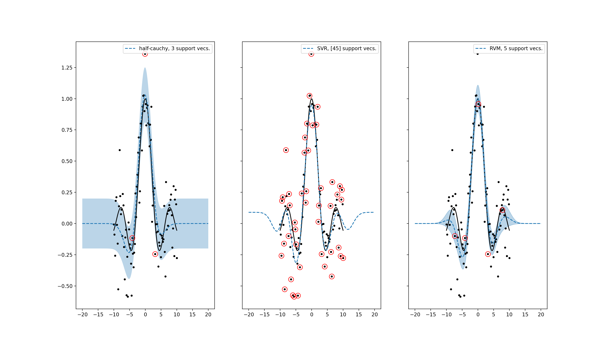

<div align="center">

# VariationalSparseBayes

#### A PyTorch library for stochastic variational inference with sparsity inducing priors.

</div>

<p align="center">

</p>

_A comparison plot for sparse Bayesian regression with a half-cauchy prior (L),
support vector regression (C), and the relevance vector machine (R). We see the
half-cauchy prior provides a more sparse solution and better error bars._

## What is VariationalSparseBayes?

This package provides an implementation of the algorithm described in
[Louizos et. al. (2017)](https://arxiv.org/pdf/1705.08665.pdf) for use on a
broad class of machine learning problems.

## Installation

```bash
pip install variationalsparsebayes
```

## Usage

The library provides a high-level interface with some prebuilt sparse Bayesian
models and a low-level interface for building custom sparse Bayesian models.

### High-level interface

The library provides a few sparse Bayesian models:

- [sparse polynomial regression](https://github.com/coursekevin/variationalsparsebayes/blob/main/examples/sparse_poly_regression.py)
- [sparse Bayesian neural networks](https://github.com/coursekevin/variationalsparsebayes/blob/main/examples/sparse_bnn_regression.py).
- sparse learning with [precomputed features](https://github.com/coursekevin/variationalsparsebayes/blob/main/examples/support_vectors.py)

To implement your own linear model, you can inherit from the [SparseFeaturesLibrary](https://github.com/coursekevin/variationalsparsebayes/blob/main/variationalsparsebayes/sparse_glm.py) class.
Note that I haven't implemented the "group" sparsity idea presented in [Louizos et. al. (2017)](https://arxiv.org/pdf/1705.08665.pdf).
Sparsification is performed at the parameter level (meaning far less computational savings).

### Low-level interface

The most important class provided by the library is the [SVIHalfCauchyPrior](https://github.com/coursekevin/variationalsparsebayes/blob/main/variationalsparsebayes/svi_half_cauchy.py#L96).
The class inherits from [nn.Module](https://pytorch.org/docs/stable/generated/torch.nn.Module.html).
The user is responsible for (i) transforming a batch of weights from the variational
posterior into a batch of predictions and (ii) adding the KL-divergence provided
by the prior onto the negative ELBO.

```python
from torch import nn
from variationalsparsebayes import SVIHalfCauchyPrior

class MyModel(nn.Module):
    def __init__(self, num_params: int):
        super().__init__()
        # we initialize the prior with tau=1e-5 (see https://arxiv.org/pdf/1705.08665.pdf)
        self.prior = SVIHalfCauchyPrior(num_params, 1e-5)
        ...

    def forward(self, x, num_reparam_samples):
        w_samples = self.prior.get_reparam_weights(num_reparam_samples)
        sparse_index = self.prior.sparse_index
        # user transforms weights and inputs into predictions
        ...

    def elbo(self, x, y):
        return log_like(x, y) - self.prior.kl_divergence()

model = MyModel(num_params)
...
```

When it comes time to sparsify the approximate posterior run:

```python
model.prior.update_sparse_index()
# get the index of all weights which remain after sparsification
model.prior.sparse_index
```
